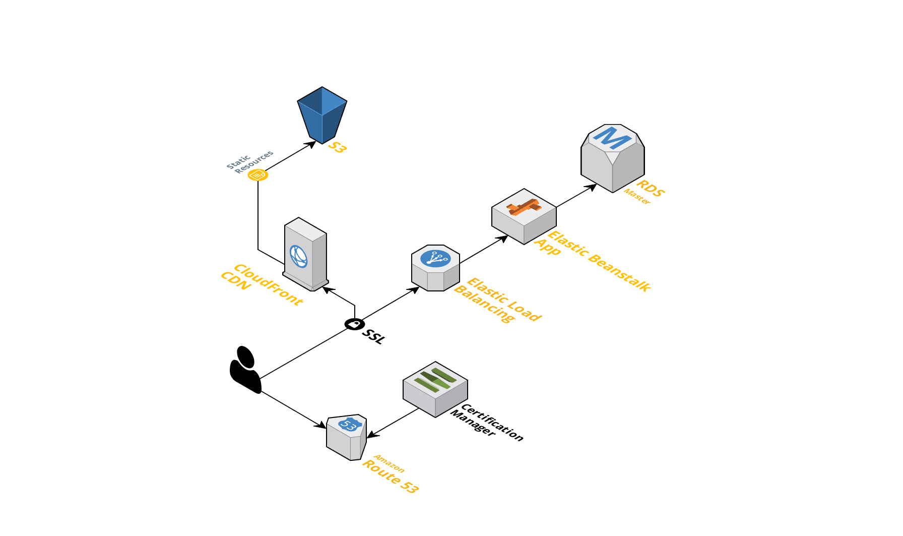
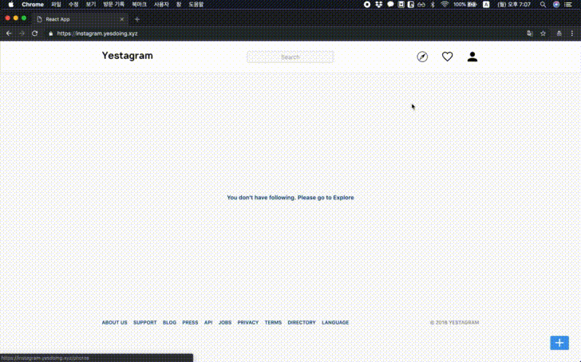
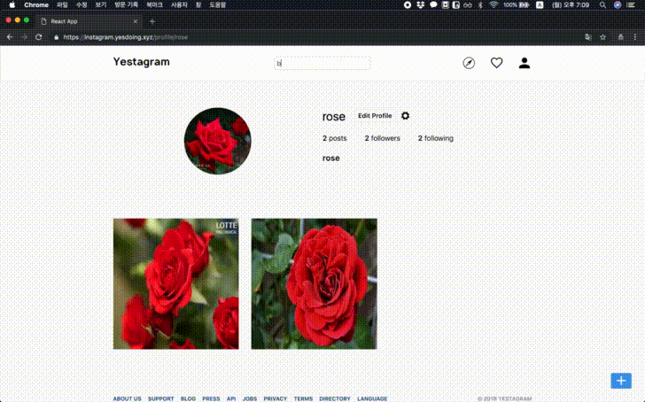
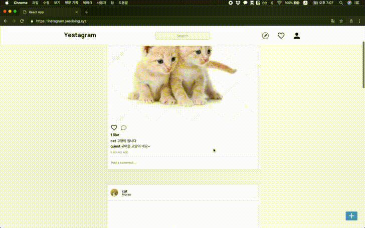
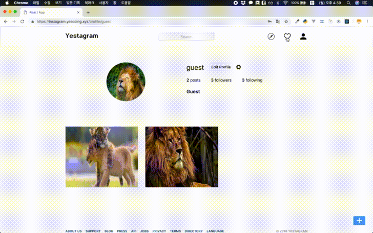
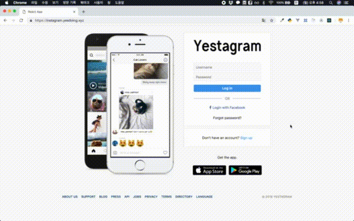
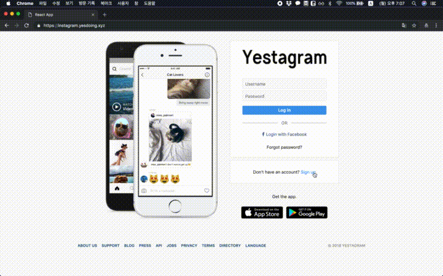

# Instagram 

# [Yestagram](https://instagram.yesdoing.xyz/)

## Introduction
Yestagram은 Instagram Clone Project입니다. 

## Tryout
<https://instagram.yesdoing.xyz/>

## Demo
<https://youtu.be/SqMTPuZY-EU>

## Period
2018년 11월 ~ 2019년 1월

## Architecture
- <details>
  <summary>미리보기</summary>
  <div markdown="1">
  
  </div>
  </details>

## Feature
- Show Feed Image
  - <details>
    <summary>미리보기</summary>
    <div markdown="1">

    </div>
    </details>
- Explore User
  - <details>
    <summary>미리보기</summary>
    <div markdown="1">
    
    </div>
    </details>
- Show User Profile
  - <details>
    <summary>미리보기</summary>
    <div markdown="1">
    
    </div>
    </details>
- Show Notification
  - <details>
    <summary>미리보기</summary>
    <div markdown="1">

    </div>
    </details>
- Search User / Image
  - <details>
    <summary>미리보기</summary>
    <div markdown="1">
    
    </div>
    </details>
- Like / UnLike
- Add Comment
  - <details>
    <summary>미리보기</summary>
    <div markdown="1">
    
    </div>
    </details>
- Follow / UnFollow
- Upload Image
- Show Detail Image
  - <details>
    <summary>미리보기</summary>
    <div markdown="1">
    
    </div>
    </details>
- Show follower / following 
  - <details>
    <summary>미리보기</summary>
    <div markdown="1">
    
    </div>
    </details>
- Login / SignUp
  - <details>
    <summary>미리보기</summary>
    <div markdown="1">
    
    
    </div>
    </details>
- Facebook Login

## Prerequisites
- Chrome Browser(권장)

## Installation
```
git clone https://github.com/kimkyeseung/polyshaper.git
pipenv shell
pipenv install 
cd instagram/
python manage.py makemigrations && python manage.py migrate
python manage.py runserver

cd frontend/
yarn install 
yarn start
```

## Tech Stack
- Frontend
    - JavaScript(ES6+)
    - React(JSX, Redux, Ducks, Thunks)
    - Scss, CSS-Module
    - Webpack
    - NodeJS
    - Yarn
- Backend
    - Python(3.7), pipenv
    - Django(Django, Django-REST-Framework, Django-REST-auth, Cookiecutter Django)
    - PostgreSQL
- Project Managing: Trello
- VSC: Git(Github)

## Deployment
- AWS의 Elastic beanstalk, RDS, S3, EC2, Route53을 사용하여 배포하였습니다. 

## Planning
- Trello를 이용하여 일정을 관리하여 진행하였습니다. 